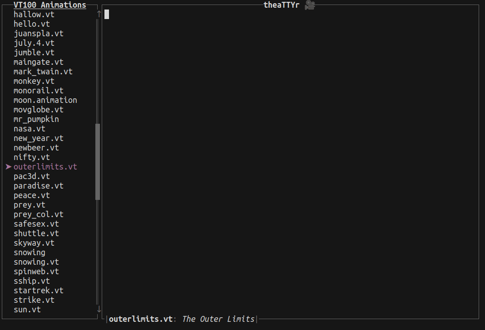
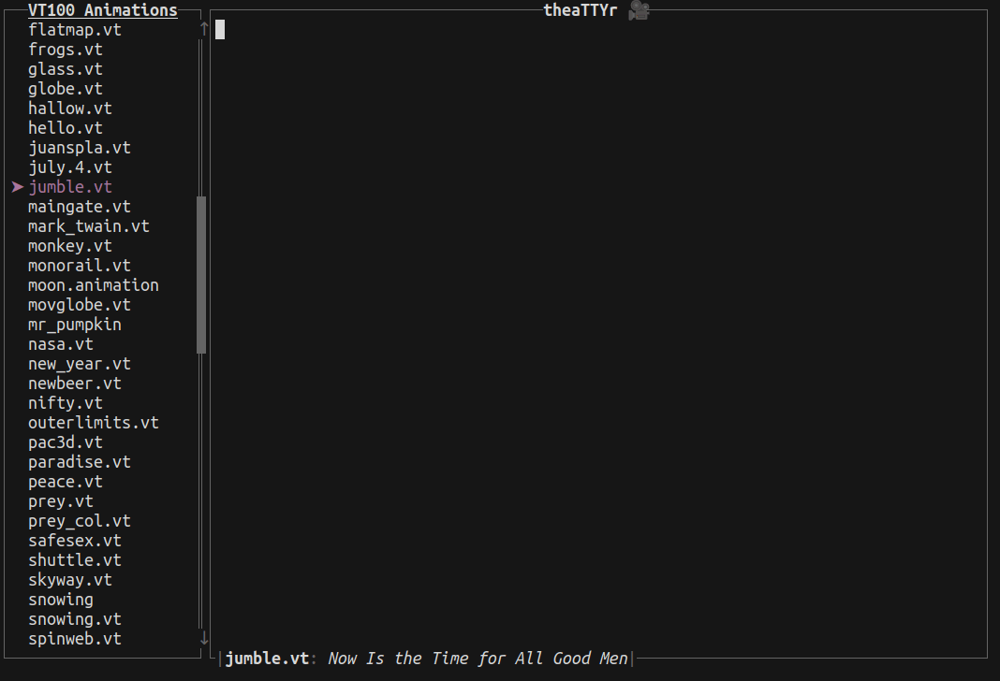
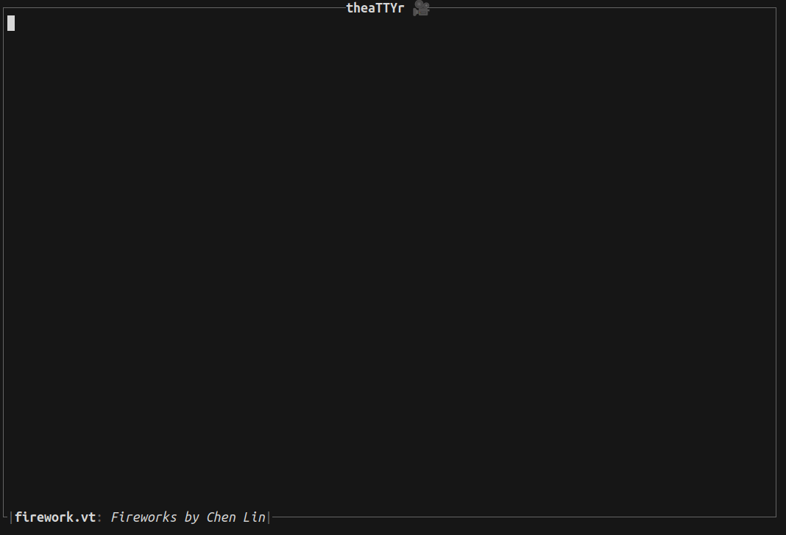

## TheaTTYr 🎥

A terminal theater for playing [VT100 art and animations](http://artscene.textfiles.com/vt100).

> [!NOTE]  
> The [VT100](https://en.wikipedia.org/wiki/VT100), introduced by DEC in 1978, was among the first video terminals to support ANSI escape codes.
>
> The ANSI art scene used the VT100's animation capabilities, made possible by codes that allowed cursor movement, deletion, and character updates to create animated effects.
>
> Usually, they represent a long hand-crafted process done by a single person to tell a story. Some of these files may date back to the 1960's and 1970's.

> [!TIP]  
> I developed this tool over a series of livestreams, which you can check out [here](https://www.youtube.com/@orhundev/streams).

### Usage

Simply run `theattyr` and browse the terminal movies!





Or you can specify a file at the start via e.g. `theattyr fireworks.vt`:



- Press <kbd>Tab</kbd> to hide the sidebar.
- You can specify a FPS value via `--fps` argument. Run `theattyr --help` for other options.

### List of Animations

See <http://artscene.textfiles.com/vt100/>

<details>
<summary>Details</summary>

| File              | Description                                                      |
| ----------------- | ---------------------------------------------------------------- |
| bambi.vt          | Bambi vs. Godzilla                                               |
| bambi_godzila     | Bambi Versus Godzilla, from Dave Brett                           |
| barney.vt         | Barney Being Crushed by a Rock                                   |
| beer.vt           | Time for a Beer Break, Folks!                                    |
| bevis.butthead.vt | Beavis and Butthead                                              |
| blinkeyes.vt      | Blinking Eyes                                                    |
| bomb.vt           | The Bomb Test                                                    |
| bugsbunny.vt      | Bugs Bunny: That's All, Folks                                    |
| cartwhee.vt       | Doing a Cartwheel                                                |
| castle.vt         | Disney's Fantasy in the Sky, by Don Bertino                      |
| cert18.vt         | Make Money Fast: The Revenge, by GtB (1993)                      |
| cow.vt            | Exploding Cow, Hauled off by U-Mass Food Service                 |
| cowboom.vt        | Cow Explodes, Gets Hauled Off                                    |
| crash.vt          | Shuttle Blows Up                                                 |
| cursor.vt         | Cursor Control Examples in VT100                                 |
| delay.vt          | A Small Delay                                                    |
| demo.vt           | Alan's Impressive Demonstration                                  |
| dirty.vt          | Someone Having an Awful Amount of Fun                            |
| dogs.vt           | Fucking Dogs                                                     |
| dont-wor.vt       | George Custer's Last Stand: Don't Worry, be Happy                |
| dontworry.vt      | Man Being Shot with Arrows: Don't Worry, Be Happy                |
| duckpaint.vt      | Duck Painting                                                    |
| firework.vt       | Fireworks by Chen Lin                                            |
| fireworks.vt      | Guy Setting Off Fireworks                                        |
| fishy-fishy.vt    | 3-D Fishy Fishy                                                  |
| fishy.vt          | Fish Swimming By, Glug Glug                                      |
| fishy2.vt         | Shamus the Fish by David Rybolt (1994)                           |
| flatmap.vt        | Shifting Flat World Map                                          |
| frogs.vt          | Hopping Frog                                                     |
| glass.vt          | Filling Glass of Liquid                                          |
| globe.vt          | ABSOLUTELY EXCELLENT Spinning Globe                              |
| hallow.vt         | Happy Halloween                                                  |
| hello.vt          | HELLO!                                                           |
| juanspla.vt       | Plan File in the Form of a Typewriter                            |
| july.4.vt         | July 4th Animation                                               |
| jumble.vt         | Now Is the Time for All Good Men                                 |
| maingate.vt       | The Disneyland Main Gate, by Don Bertino                         |
| mark_twain.vt     | The Mark Twain Ferry, by Don Bertino                             |
| monkey.vt         | The Monkey Gives You The Finger                                  |
| monorail.vt       | Disneyland's Monorail, by Don Bertino                            |
| moon.animation    | Winking Moon Says Good Evening                                   |
| movglobe.vt       | Incredible Spinning, Moving Globe                                |
| mr_pumpkin        | Happy Halloween Pumpkin by Mike Kamlet                           |
| nasa.vt           | NASA: Keep Reaching for the Stars, by A.J.L.                     |
| new_year.vt       | Happy New Year to You                                            |
| newbeer.vt        | Working on a VT100                                               |
| nifty.vt          | Small Animated Word NIFTY                                        |
| outerlimits.vt    | The Outer Limits                                                 |
| pac3d.vt          | Pac Man in 3-D Chomping a Ghost                                  |
| paradise.vt       | A Bomb in Paradise by Gonad the Barbarian                        |
| peace.vt          | Imagine World Peace by John G. Poupore                           |
| prey.vt           | Klingon Bird of Prey                                             |
| prey_col.vt       | Klingon Bird of Prey                                             |
| safesex.vt        | Safe Sex (Literally)                                             |
| shuttle.vt        | Technology, Who Needs It                                         |
| skyway.vt         | Disneyland's Skyway, by Don Bertino                              |
| snowing           | Merry Christmas from Woodrow                                     |
| snowing.vt        | Tis the Season: Merry Christmas                                  |
| spinweb.vt        | Spinning Web by R.L. Samuell (April 6, 1994)                     |
| sship.vt          | Space Ship Warps and Fires                                       |
| startrek.vt       | Star Trek Enterprise Blows up Politically Correct New Enterprise |
| strike.vt         | Bowling a Strike                                                 |
| sun.vt            | A Happy Sun                                                      |
| surf.vt           | Surfing Wave (In 3-D)                                            |
| tetris.vt         | Tetris Game                                                      |
| tomorrw.vt        | Disneyland's Tomorrowland, by Don Bertino                        |
| torturet.vt       | VT100 FONT: The VT-100 Torture Test by Joe Smith (May 8, 1985)   |
| treadmill.vt      | The Treadmill, by GtB Productions (1993)                         |
| trek.vt           | The Enterprise Blows up an RCA Satellite                         |
| trekvid.vt        | Politically Incorrect Star Trek                                  |
| turkey.vt         | Happy Thanksgiving                                               |
| tv.vt             | The Outer Limits Television Show                                 |
| twilight.vt       | The Twilight Zone                                                |
| twilightzone.vt   | Twilight Zone Opener                                             |
| valentin.vt       | Happy Valentine's Day, Beth and Dave                             |
| valentine.vt      | Happy Valentine's Day, Jane and Chris                            |
| van_halen.vt      | Van Halen's Song 5150, Animated                                  |
| wineglas.vt       | Wine Glass Filling                                               |
| xmas-00.vt        | Santa Holds Moving Sign: Merry Christmas, Happy New Year         |
| xmas-01.vt        | Merry Christmas                                                  |
| xmas-02.vt        | Bird Flies By, Tree Grows, Merry Christmas                       |
| xmas-03.vt        | Merry Christmas (Tree, Train, Presents)                          |
| xmas-04.vt        | Merry Christmas, Champagne Glass Filling, Jack-in-the-Box        |
| xmas-05.vt        | Happy Holidays, Starry Night, Christmas Tree, by Peter           |
| xmas-06.vt        | Merry Christmas: Hearth and Tree                                 |
| xmas-07.vt        | A Christmas Card: Merry Christmas, from MIS                      |
| xmas-08.vt        | Christmas Eve, 1992 (1992)                                       |
| xmas-09.vt        | Merry Christmas: Reindeer Land on Roof                           |
| xmas.large        | Compilation of Several Christmas Animations                      |
| xmas.vt           | Merry Christmas                                                  |
| xmas2.vt          | Large Collection of Christmas Animations                         |
| xmasshort.vt      | Merry Christmas, Tree, Train, Present                            |
| zorro.vt          | The Story of Zorro by Cian O'Kiersey                             |

</details>

### Installation

#### Cargo 📦

```shell
cargo install theattyr
```

## License

[](./LICENSE-MIT)
[](./LICENSE-APACHE)

Licensed under either of [Apache License Version 2.0](./LICENSE-APACHE) or [The MIT License](./LICENSE-MIT) at your option.

🦀 ノ( º \_ º ノ) - respect crables!

## Copyright

Copyright © 2024, [Orhun Parmaksız](mailto:orhunparmaksiz@gmail.com)
